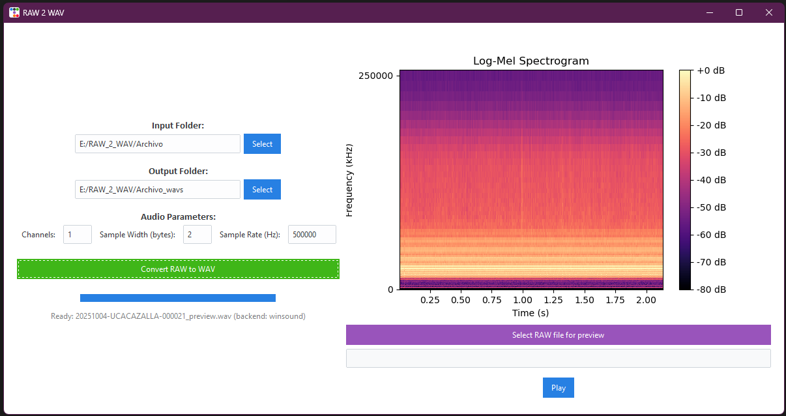

# RAW to WAV Converter

**RAW to WAV Converter** is a simple, user-friendly desktop application designed to convert `.raw` audio files into `.wav` format. It was created for researchers and biologists who need to process recordings quickly without worrying about technical details.

Please, if used, cite as:

````bibtex
@software{Marquez_Rodriguez_RAW2WAV_2025,
  author       = {Alba Márquez Rodríguez},
  title        = {RAW 2 WAV},
  year         = {2025},
  version      = {1.0},
  url          = {https://github.com/GrunCrow/RAW_2_WAV},
  note         = {Software for converting RAW audio files to WAV with folder structure preservation and GUI.}
}
````



---

## Features

- **Batch convert** all `.raw` files in a folder (recursively), mirroring input folder structure into the output folder.
- **Configurable audio parameters** (Channels, Sample width in bytes, Sample rate).
    - Default values: Channels=1, Sample Width=2 bytes, Sample Rate=500000 Hz.
- **Preview a single RAW file:** temporary WAV conversion, play/pause (pygame on multi-platform or winsound on Windows), and stop.
- **Spectrogram preview:** log-mel spectrogram (librosa when available, fallback to matplotlib), time axis in seconds, frequency axis labeled in Hz or kHz; mel-frequency spacing respected in the Y axis.
- **Persistent settings** stored in %APPDATA%/raw2wav/settings.json (window geometry, last folders and audio parameters).
- **Conversion log** saved as `conversion_log.csv` in the output folder (records raw path, wav path and parameters).
- **Simple progress bar** and status messages during conversion.

---

## How to Use

1. Launch the application executable (`.exe` on Windows, binary on Linux/Mac).
2. Click ``Select`` to choose an input folder containing `.raw` files.
3. The output folder is suggested automatically (input folder + `_wavs`) but can be changed.
4. Verify or change audio parameters (defaults: Channels=1, Sample Width=2, Sample Rate=500000).
5. Click ``Convert RAW to WAV`` to convert all files. Monitor progress with the progress bar.
6. Use ``Select RAW file for preview`` to inspect a single file — the app will create a temporary WAV in your OS temp folder, draw the spectrogram and allow playback.
7. After conversion check ``conversion_log.csv`` in the output folder.

---

**Note:** This app is distributed as a standalone executable. No additional installation of Python or libraries is required.
